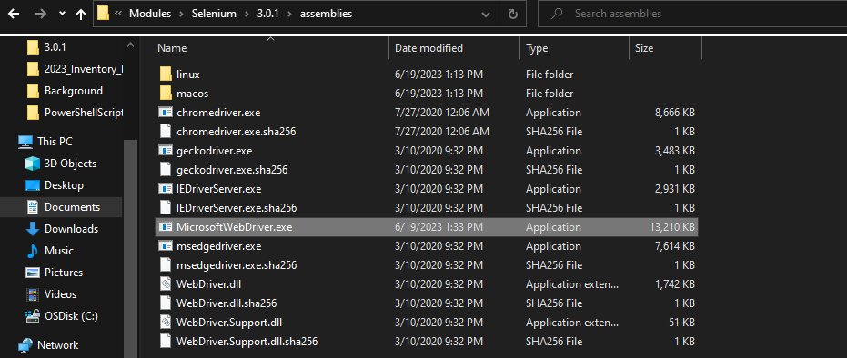

# John's PowerShell Script
This program automates the task of opening an Excel spreadsheet containing hardware asset information and inputs them into the asset's corresponding page by using Windows PowerShell, the Microsoft Edge WebDriver, and the Selenium Module.

### Before Running
If you have not ran a PowerShell script before, you most likely will need to enable scripts on your operating system, as well as install the Selenium module.
Open the Windows PowerShell console:
```powershell
Set-ExecutionPolicy -ExecutionPolicy Bypass -Scope CurrentUser # Use this if you are restricted by admin privileges.
Install-Module Selenium -Scope CurrentUser # This gives us the framework that allows us to manipulate the web browser.
```
It will prompt to ask if you trust the repository -- press [Y] for yes.

Download the Microsoft Edge WebDriver (I have provided a copy in this repo). Place it into your Windows PowerShell Selenium Assemblies filepath. 
*Example: C:\Users\CD4356\Documents\WindowsPowerShell\Modules\Selenium\3.0.1\assemblies


### Usage
```powershell
# Navigate to the file path where the script is stored
.\script.ps1
```
This will start the script and open up Microsoft Edge as well as Excel.

Copy an Asset Tag from the spreadsheet, click off the spreadsheet to unselect the item and paste into the console.

The script will automate pasting the Asset Tag into the search bar, filter by hardware asset, and navigating to the asset’s corresponding page. It will then place all the information found in the spreadsheet.

Once this process is done, double check that the information is correct and leave the page by either saving or canceling. The script is now ready to be reran!
